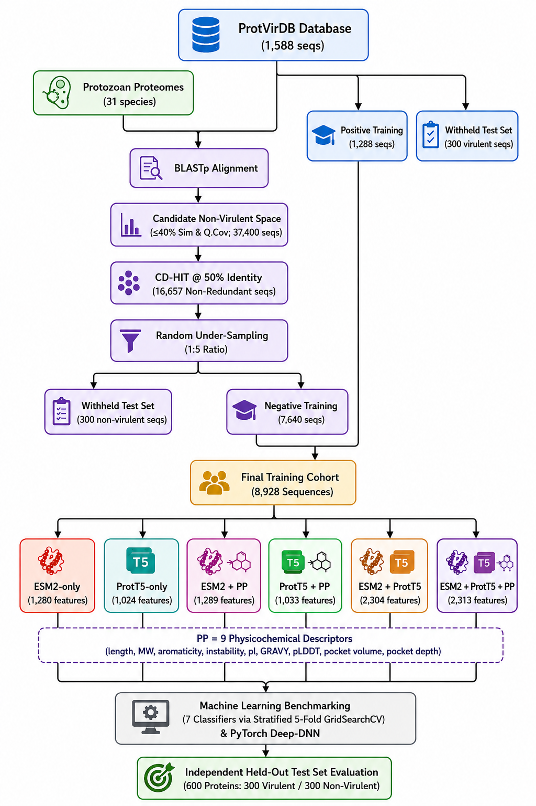

 ##**ParaVirPred — Machine learning based virulence prediction in parasites(command-line)**
> **command-line companion to the [ParaVirPred](https://paravirpred.app) web platform.**
> Predict virulence  of parasitic proteins using pre-trained machine learning and deep learning models — no internet connection required after setup.

---

## Table of Contents

- [Overview](#overview)
- [Workflow](#workflow)
- [Supported Embedding Variants](#supported-embedding-variants)
- [Supported Model Types](#supported-model-types)
- [Installation](#installation)
- [Downloading Models](#downloading-models)
- [Usage](#usage)
- [Output](#output)
- [Examples](#examples)
- [Troubleshooting](#troubleshooting)
- [Citation](#citation)

---

## Overview

**ParaVirPred** is a machine learning–based framework developed to predict the virulence potential of parasite proteins. The prediction model was trained on **8,928 protein sequences**, comprising **1,288 experimentally validated virulent proteins** obtained from ProtVirDB and **7,640 non-virulent proteins** collected from 31 protozoan proteomes. Model performance was evaluated using an independent held-out test set of **600 proteins (300 virulent and 300 non-virulent)**.

The **ParaVirPred web server** provides an intuitive platform for online virulence prediction. This GitHub repository complements the web application by providing the complete standalone prediction pipeline, allowing researchers to run ParaVirPred locally on their own systems and integrate it into custom bioinformatics workflows.

The repository includes the **`predict_virulence.py`** script, which reproduces the same inference pipeline used by the ParaVirPred web server. It utilizes the identical protein language model embeddings, feature preprocessing, feature labelling, trained deep neural network architecture, and model weights, ensuring that local predictions are consistent with those generated by the web interface when the same input sequences are provided.

Once the required dependencies and pretrained models have been installed, the prediction pipeline can be executed entirely on the local machine without relying on the ParaVirPred web server. This enables users to perform virulence prediction on their own datasets while maintaining reproducibility and consistency with the online platform.

This repository is intended for researchers who wish to:

* Perform virulence prediction on large protein datasets locally.
* Integrate ParaVirPred into automated bioinformatics pipelines.
* Reproduce published analyses using the original prediction workflow.
* Customize or extend the prediction pipeline for future research and development.

The repository contains all scripts, trained models, and supporting resources required to reproduce the ParaVirPred prediction workflow in a standalone environment.

**Key features:**
- Supports **6 embedding variants** (ESM2, ProtT5, and combinations with physicochemical descriptors)
- Supports **classical ML models** (`.pkl`: SVM, XGBoost, Random Forest, etc.) and **deep DNN models** (`.pth`: PyTorch)
- **Auto-detects the embedding variant** from the model filename — no manual configuration needed
- Outputs results as **CSV or Excel (.xlsx)**
- Automatically uses **CUDA → MPS (Apple Silicon) → CPU** in priority order

---

## Workflow

The figure below illustrates the complete training and validation pipeline used to build all ParaVirPred models.



**Pipeline summary:**
1. **ProtVirDB** (1,588 sequences) was split into Positive Training (1,288 seqs) and a Withheld Virulent Test Set (300 seqs).
2. **31 protozoan proteomes** were aligned against ProtVirDB via BLASTp; sequences with ≤40% similarity and query coverage were retained as Candidate Non-Virulent Space (37,400 seqs).
3. Redundancy was removed with **CD-HIT @ 50% identity** (16,657 seqs), followed by **1:5 random under-sampling** to yield 7,640 Negative Training sequences and a Withheld Non-Virulent Test Set (300 seqs).
4. The **Final Training Cohort (8,928 sequences)** was embedded using six feature variants and benchmarked across 7 classical classifiers (via Stratified 5-Fold GridSearchCV) and a PyTorch Deep-DNN.
5. All models were evaluated on the **Independent Held-Out Test Set (600 proteins)**.

---

## Supported Embedding Variants

The script auto-detects the required variant from the **model filename**. Name your model files accordingly.

| Variant | Model filename must contain | Feature Dimensions |
|---|---|---|
| ESM2 only | `esm2_only` | 1,280 |
| ProtT5 only | `prott5_only` | 1,024 |
| ESM2 + Physicochemical | `esm2_physchem` | 1,289 |
| ProtT5 + Physicochemical | `prott5_physchem` | 1,033 |
| ESM2 + ProtT5 | `esm2_prott5` | 2,304 |
| ESM2 + ProtT5 + Physicochemical | `esm2_prott5_physchem` | 2,313 |

**PP = 9 Physicochemical Descriptors:** length, MW, aromaticity, instability index, isoelectric point (pI), GRAVY, pLDDT, pocket volume, pocket depth.

---

## Supported Model Types

| Extension | Model type | Notes |
|---|---|---|
| `.pkl` | Scikit-learn / XGBoost (SVM, RF, XGBoost, etc.) | Loaded via `joblib` |
| `.pth` | PyTorch Deep-DNN (`VirulenceDNN`) | Loaded via `torch` |

---
## Computational Requirements

The ParaVirPred models were developed, trained, and evaluated on a workstation with the following hardware configuration:

| Component | Specification |
|----------|---------------|
| Processor | 12th Gen Intel® Core™ i9-12900 |
| CPU | 16 physical cores (24 logical threads) |
| GPU | NVIDIA GeForce RTX 3060 (12 GB VRAM) |
| RAM | 32 GB |
| Operating System | Ubuntu Linux (64-bit) |
| CUDA Version | CUDA 13.2 |

---
## Installation

### Step 1 — Clone the repository

```bash
git clone https://github.com/<your-username>/ParaVirPred-Standalone.git
cd ParaVirPred-Standalone
```

### Step 2 — Create a conda environment (recommended)

```bash
conda create -n paravirpred python=3.10 -y
conda activate paravirpred
```

### Step 3 — Install PyTorch

Visit **https://pytorch.org/get-started/locally/** and select your OS, package manager, and CUDA version. Examples:

```bash
# CPU-only (works on all platforms)
pip install torch --index-url https://download.pytorch.org/whl/cpu

# CUDA 12.1 (Linux/Windows with NVIDIA GPU)
pip install torch --index-url https://download.pytorch.org/whl/cu121

# Apple Silicon (MPS) — standard pip install works
pip install torch
```

### Step 4 — Install fair-esm (ESM2)

```bash
pip install fair-esm
```

> If you encounter issues, install from source:
> ```bash
> pip install git+https://github.com/facebookresearch/esm.git
> ```

### Step 5 — Install remaining dependencies

```bash
pip install -r requirements.txt
```

> **Note:** `torch` is already listed in `requirements.txt` as a version pin only. The actual installation command from Step 3 is what matters for your platform — don't skip Step 3.

---

## Downloading Models

Download your chosen model files from the **ParaVirPred web platform** (https://bioinfo.niab.res.in/ParaVirPred) and place them in the same folder as `predict_virulence.py`, or in any directory and pass the full path with `-m`.

**Important:** Do not rename model files — the variant is auto-detected from the filename. Keep names like `esm2_only_svm.pkl`, `prott5_physchem_dnn.pth`, etc.

---

## Usage

```
python3 predict_virulence.py -i <input.fasta> -m <model_file> -o <output_file>
```

| Argument | Required | Description |
|---|---|---|
| `-i` / `--input` | Yes | Path to input FASTA file (one or more protein sequences) |
| `-m` / `--model` | Yes | Path to model file (`.pkl` or `.pth`) |
| `-o` / `--output` | No | Output file path (`.csv` or `.xlsx`). Default: `predictions_output.csv` |

---

## Output

The output file contains one row per input sequence:

| Column | Description |
|---|---|
| `Protein_ID` | Sequence ID from the FASTA header (first token after `>`) |
| `Prediction` | `Virulent` or `Non-Virulent` |
| `Confidence_Probability` | Model confidence score (0.0 – 1.0). Threshold: ≥ 0.5 = Virulent |

A summary is also printed to the terminal at the end:

```
Inferences saved successfully to: output.csv
Total proteins      : 1588
Virulent            : 312
Non-Virulent        : 1276
```

---

## Examples

### Predict using an ESM2-only SVM model, output CSV

```bash
python3 predict_virulence.py \
    -i my_proteins.fasta \
    -m esm2_only_svm.pkl \
    -o results.csv
```

### Predict using a ProtT5 + Physicochemical DNN model, output Excel

```bash
python3 predict_virulence.py \
    -i my_proteins.fasta \
    -m prott5_physchem_dnn.pth \
    -o results.xlsx
```

### Predict using the full ESM2 + ProtT5 + Physicochemical XGBoost model

```bash
python3 predict_virulence.py \
    -i my_proteins.fasta \
    -m esm2_prott5_physchem_xgb.pkl \
    -o results.csv
```

### Use full paths if files are in different directories

```bash
python3 predict_virulence.py \
    -i /data/proteome.fasta \
    -m /models/esm2_physchem_svm.pkl \
    -o /results/output.xlsx
```

---

## Troubleshooting

**`Could not detect embedding variant from model filename`**
→ Your model filename does not contain a recognized variant keyword. Rename it to include one of: `esm2_only`, `prott5_only`, `esm2_physchem`, `prott5_physchem`, `esm2_prott5`, `esm2_prott5_physchem`.

**`X has N features, but StandardScaler is expecting M features`**
→ The model file and the detected variant are mismatched. Make sure the filename accurately describes the embedding the model was trained on.

**`ModuleNotFoundError: No module named 'esm'`**
→ Run `pip install fair-esm` and retry.

**`ModuleNotFoundError: No module named 'torch'`**
→ PyTorch is not installed. Follow Step 3 of the installation guide above.

**ProtT5 or ESM2 model download is slow on first run**
→ The embedding models (~3 GB for ProtT5, ~1.3 GB for ESM2) are downloaded from HuggingFace / PyTorch Hub on first use and cached locally. Subsequent runs use the cache and are fast.

**Out of memory on large FASTA files**
→ Run on CPU (`CUDA_VISIBLE_DEVICES=""` on Linux) or process the FASTA in smaller batches. Sequences are processed one at a time so peak memory stays bounded.

---

## Citation

If you use ParaVirPred in your research, please cite:

```
Shekhar Gudda,Antisha Sarkar,Sandeep Kumar Kushwaha.
ParaVirPred: Pan-genome Based Identification and Virulence Prediction
of Drug Targets in Parasitic Species.
National Institute of Animal Biotechnology (NIAB), Hyderabad, India. 2025.
```

---

## License

This project is released for academic and research use.
For commercial licensing, please contact the authors.

---

*Built with Python · PyTorch · HuggingFace Transformers · fair-esm · scikit-learn · Biopython*
